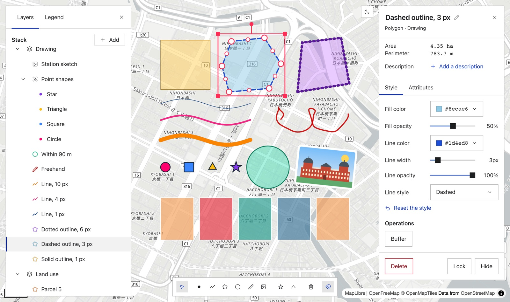
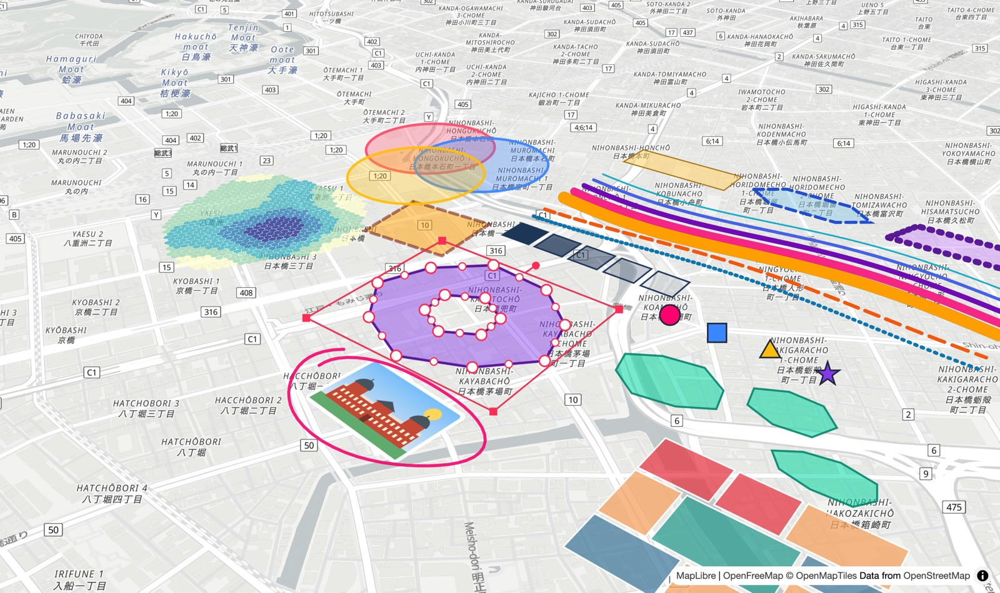
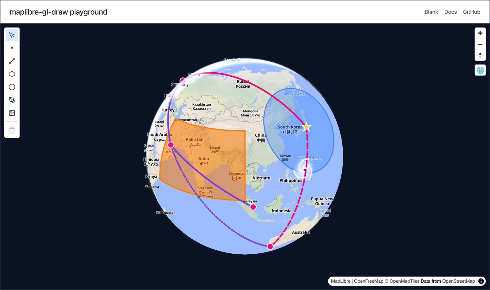
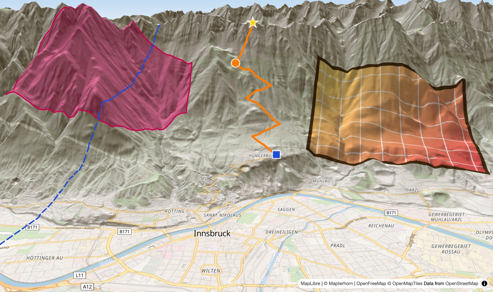
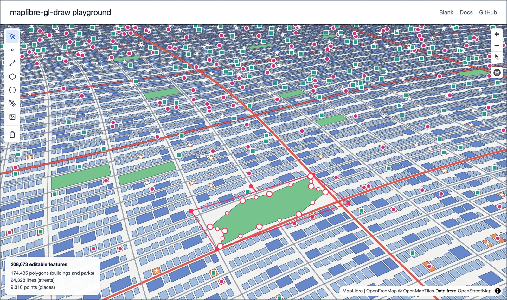

# @sakuzu/maplibre-gl-draw

[MapLibre GL JS][maplibre] の地図の上に図形を描き、編集するための
ライブラリーです。独自の WebGL2 レンダラーで描くので、20 万の地物を
載せても編集できます。3D 地形や地球儀の上にも、平らな地図と同じように
描けます。

[デモ][demo] | [ドキュメント](docs/README.ja.md) | [API リファレンス][api] |
[English](README.md)

このページの正は英語版 ([README.md](README.md)) です。



## 機能

### 描画

点、線、面、円、フリーハンドの線を、マウス、タッチ、ペン、キーボードで
描けます。用意した画像を地図の上に置くこともできます
([描画](docs/guides/drawing.ja.md))。

### 選択と変形

地物をクリックで 1 つずつ、または矩形で囲んでまとめて選べます。選んだ
地物は移動、拡大縮小、回転ができます。

### 頂点の編集

頂点を足したり、消したり、動かしたりできます。MultiPolygon のように
複数の部分からなる地物や、面の穴の頂点も同じように編集できます。

### 吸着

描いている途中の点は、近くにある既存の頂点、辺、辺どうしの交点、水平や
垂直などの角度のガイドに吸着します。隣り合う区画を描くときは、既存の
境界の上の 2 点をクリックするだけで、その間の境界に沿った頂点が入ります
([吸着と幾何演算](docs/guides/snapping-geometry.ja.md))。

### 幾何演算

選んだ面どうしの結合、切り抜き、交差、線による分割、一定の距離だけ
広げるバッファができます。距離、長さ、面積も計算できます。これらの計算は
地図に依存しない関数として `@sakuzu/maplibre-gl-draw/geometry` に
まとめてあり、ブラウザーの外 (Node や Bun) でも同じ結果が得られます。

### スタイル

色、不透明度、線の太さ、破線と点線、点の形を決められます。スタイル規則を
使うと、地物が持つ属性の値 (土地の用途や人口など) に応じて色を自動で
分けられます ([スタイル](docs/guides/styles.ja.md))。

### レイヤーとグループ

レイヤーとグループで地物をまとめられます。レイヤーは並べ替え、非表示、
ロック、半透明化ができます。基図の道路や建物など MapLibre 自身の
レイヤーを、このライブラリーのレイヤーの間に挟んで描くこともできます
([レイヤー](docs/guides/layers.ja.md))。

### 傾けた地図、地球儀、3D 地形

地図を傾けても、回しても、地球儀の表示にしても、3D 地形を有効にしても、
平らな地図と同じように描けます。日付変更線をまたぐ地物も描けます
([地形](docs/guides/terrain.ja.md))。

最初の画像と同じ図形を、地図を傾けて回して見たところです。



地球儀の上では、大圏航路も日付変更線をまたぐ領域も描けます。



3D 地形の上では、地物は斜面に沿い、尾根の向こうは尾根に隠れます。



### 大量の地物

20 万の地物を載せても編集できます。次の画像の 20 万 8,073 件の地物は、
すべて編集できます ([性能](docs/guides/performance.ja.md))。



### データセット

数万件の区画や 100 万件の点のような大きなデータを、編集の対象に
しない代わりに速く表示します。全部を一度に渡すほか、地図を動かす
たびに見えている範囲の分だけサーバーから取り寄せることもできます。
GeoParquet や Arrow の表は、点、線、多角形が行ごとに混ざっていても
列の形のまま渡せるので、行ごとに変換する時間がかかりません。読み込み
は Worker で行えるので、大きなファイルを開いても画面は止まりません。見た目は描いた地物と同じスタイル規則で
決められ、クリックすると属性を読めます
([大量のデータ](docs/guides/large-data.ja.md))。

### 保存と読み込み

文書を独自形式で書き出すと、レイヤー、グループ、スタイル、画像まで
含めて保存でき、読み込めば同じ状態に戻ります。GeoJSON で書き出せば、
ほかのツールと地物をやり取りできます。地物は GeoJSON の図形と
GeoJSON の properties を持つので、ファイルはコードで読む地物と同じ形に
なります。
変更は取引ごとに 1 つのイベントで、出どころを添えて届きます。文書を
保存するストアは差し替えられます
([保存と読み込み](docs/guides/save-load.ja.md))。

### 閲覧専用

閲覧専用モードと操作のロックがあり、描いたものを見せるだけの画面を
作れます ([読み取り専用](docs/guides/read-only.ja.md))。

### 拡張

プラグイン、独自のモード、独自の描き方を持つ地物の型、重ね描き、
吸着の候補やハンドルの提供者を足せます。どの種類も同じ方法で足し、
足したときに返る関数で外します
([プラグイン](docs/guides/plugins.ja.md)、
[独自の型](docs/guides/custom-types.ja.md))。

## デモ

ブラウザーですぐに試せます。インストールは要りません。

- [プレイグラウンド][demo]
  - すべての機能を 1 つの画面で。標準の UI 付き
- [例][examples]
  - 18 の例。どれも、例を動かすページにそのコードを添えています

例の一部を挙げます。

- [Get started][ex-get-started]
  - 地物を描き、選び、パネルで直す
- [Save and load][ex-save-and-load]
  - GeoJSON と独自形式、地図に落としたファイル、読み込みで外された地物
- [Style rules and legend][ex-style-rules-and-legend]
  - 属性の値で色を分ける 4 種類の規則と凡例
- [Snapping and tracing][ex-snapping-and-tracing] と
  [Geometry operations][ex-geometry-operations]
  - 吸着、境界のなぞり、結合、交差、差、分割、バッファー
- [Terrain][ex-terrain]
  - 3D 地形の上での描画と編集
- [Read-only viewer][ex-read-only-viewer]
  - 見るための描画。閲覧専用、操作のロック、クリックした地物の属性
- [Plugins][ex-plugins]
  - 独自のモードを持つプラグインと、標準の UI に足すその道具
- [Custom feature types][ex-custom-feature-types]
  - 独自の描き方、当たり判定、範囲選択を持つ地物の型
- [Datasets][ex-datasets]
  - 5 万のマス目の色分けと、見えている範囲の点の取り寄せ
- [Columnar data in a Worker][ex-columnar-data-in-a-worker]
  - Worker で読み込み、列のまま描く 20 万行
- [Build your own UI][ex-custom-ui]
  - 標準の UI を使わない、自分の道具のバーとパネル

## インストール

```sh
npm install @sakuzu/maplibre-gl-draw
```

maplibre-gl は peer dependency です。アプリにすでに入っている
maplibre-gl (`~6.11.1`) を使います。まだ入っていなければ、npm 7 以降は
一緒にインストールされます。

## 使い方

```ts
import * as maplibregl from 'maplibre-gl';
import 'maplibre-gl/dist/maplibre-gl.css';
import workerUrl from 'maplibre-gl/dist/maplibre-gl-worker.mjs?worker&url';
import { createDraw } from '@sakuzu/maplibre-gl-draw';

// maplibre-gl v6 はページごとに 1 回 worker の URL を要する (これは Vite の例)
maplibregl.setWorkerUrl(workerUrl);

const map = new maplibregl.Map({
  container: 'map',
  style: 'https://tiles.openfreemap.org/styles/liberty',
  center: [139.767, 35.681],
  zoom: 12,
});

const draw = createDraw(map);

// 自分のボタンで描き始める。クリックで頂点を足し、最初の頂点のクリックか
// Enter で確定する
document.querySelector('#polygon')?.addEventListener('click', () => {
  draw.setMode('draw_polygon');
});

draw.on('feature.created', ({ feature }) => {
  console.log(feature.id, feature.type, feature.geometry);
});

// すべての地物を GeoJSON の FeatureCollection で得る
document.querySelector('#save')?.addEventListener('click', () => {
  console.log(JSON.stringify(draw.document.toGeoJSON()));
});
```

[はじめかた](docs/getting-started.ja.md) では、このページを順を追って
作ります。[Get started][ex-get-started] の例は、自分のボタンの代わりに
標準の UI を地図に重ねます。

## 入口

ほかの入口が要るとき以外は、main の入口から import します。

- `@sakuzu/maplibre-gl-draw` は、描画のインスタンス (`createDraw`)、
  その地物、レイヤー、グループ、データセット、イベント、設定、拡張の
  窓口です
- `@sakuzu/maplibre-gl-draw/geometry` は、地図の要らない図形の計算
  です。長さや面積を測る、円やバッファーを作る、面を合成して分ける
  ことができます。Node や Worker でも動きます
- `@sakuzu/maplibre-gl-draw/table` は、大きな表を Worker で読んで
  データセットに渡す部品です
- `@sakuzu/maplibre-gl-draw/webgl` は、独自のシェーダーを書くための
  部品です。小さい版で変わることがあります。ほかの 3 つはセマンティック
  バージョニングに従います

## 動作環境

- maplibre-gl `~6.11.1` で動き、WebGL2 が必要です。
- ESM のみで、TypeScript の型が付いています。フレームワークには依存
  しません ([フレームワーク](docs/guides/frameworks.ja.md))。

## 制約

- 地物は、MapLibre GL JS の[カスタムレイヤー][custom-layer]の中に、この
  ライブラリーのレンダラーで描いています。MapLibre のスタイルのレイヤー
  ではないので、MapLibre の `queryRenderedFeatures` やスタイル式からは
  見えません。地物を調べたり色を変えたりするときは、このライブラリーの
  API とイベントを使います。
- 経度は [-180, 180] の範囲で扱います。
- 幾何演算は、日付変更線と極の付近では使えません。

## ドキュメント

[docs/README.ja.md](docs/README.ja.md) に、はじめかた、手引き、
リファレンス、内部の文書を読む順に並べています。1.0、mapbox-gl-draw、
terra-draw から移る場合は [移行](docs/guides/migrating.ja.md) を参照して
ください。[API リファレンス][api] のメインのエントリーのページは、
インスタンスの資源とそれぞれのメソッドの一覧から始まります。

## 開発に参加する

開発の手順は [CONTRIBUTING.ja.md](CONTRIBUTING.ja.md) にあります。
プルリクエストは [CLA.md](CLA.md) の貢献者ライセンス契約のもとで歓迎
します。貢献した部分の著作権はあなたに残ります。

## ライセンス

Copyright (C) 2026 SAKAIDA Atsushi.

GNU Affero General Public License version 3 (`AGPL-3.0-only`) で提供して
います。全文は [LICENSE](LICENSE) にあります。

AGPL が製品に合わない場合は、Kasika, Inc. (可視化技研株式会社) から商用
ライセンスを受けられます。連絡先は <https://www.kasika.xyz/> です。

このパッケージに含まれる第三者のコードの表示は
[THIRD_PARTY_NOTICES.ja.md](THIRD_PARTY_NOTICES.ja.md) にあります。

[maplibre]: https://maplibre.org/maplibre-gl-js/docs/
[custom-layer]: https://maplibre.org/maplibre-gl-js/docs/API/interfaces/CustomLayerInterface/
[demo]: https://sakuzu.github.io/maplibre-gl-draw/playground/
[api]: https://sakuzu.github.io/maplibre-gl-draw/api/
[examples]: https://sakuzu.github.io/maplibre-gl-draw/ja/examples/
[ex-get-started]: https://sakuzu.github.io/maplibre-gl-draw/ja/examples/get-started.html
[ex-save-and-load]: https://sakuzu.github.io/maplibre-gl-draw/ja/examples/save-and-load.html
[ex-style-rules-and-legend]: https://sakuzu.github.io/maplibre-gl-draw/ja/examples/style-rules-and-legend.html
[ex-snapping-and-tracing]: https://sakuzu.github.io/maplibre-gl-draw/ja/examples/snapping-and-tracing.html
[ex-geometry-operations]: https://sakuzu.github.io/maplibre-gl-draw/ja/examples/geometry-operations.html
[ex-terrain]: https://sakuzu.github.io/maplibre-gl-draw/ja/examples/terrain.html
[ex-read-only-viewer]: https://sakuzu.github.io/maplibre-gl-draw/ja/examples/read-only-viewer.html
[ex-plugins]: https://sakuzu.github.io/maplibre-gl-draw/ja/examples/plugins.html
[ex-custom-feature-types]: https://sakuzu.github.io/maplibre-gl-draw/ja/examples/custom-feature-types.html
[ex-datasets]: https://sakuzu.github.io/maplibre-gl-draw/ja/examples/datasets.html
[ex-columnar-data-in-a-worker]: https://sakuzu.github.io/maplibre-gl-draw/ja/examples/columnar-data-in-a-worker.html
[ex-custom-ui]: https://sakuzu.github.io/maplibre-gl-draw/ja/examples/custom-ui.html
